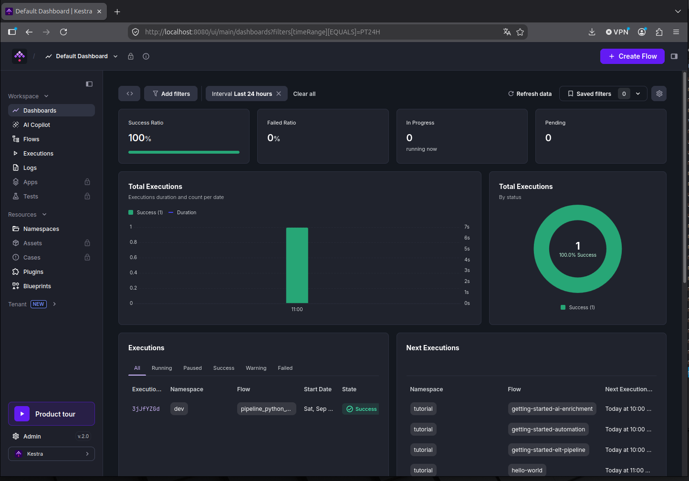
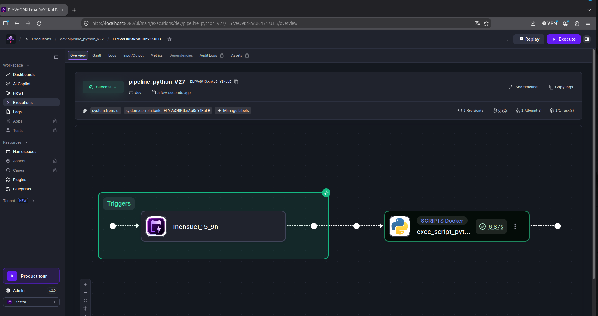
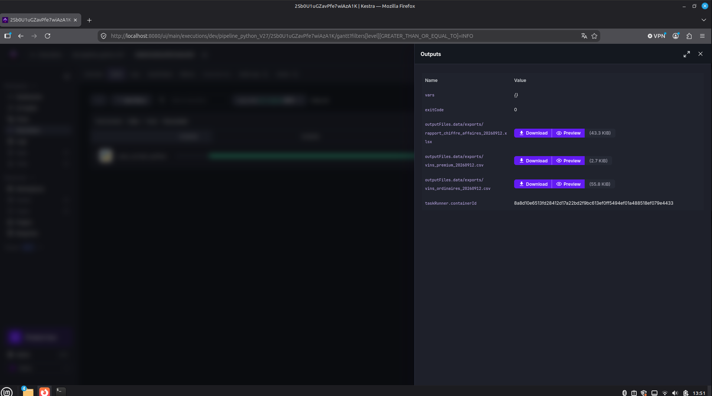

Mettez en place un pipiline d'orchestration des flux

## contenu du repository

* Mise en service sur une base  Docker avec installation de Kestra

* scripts python de nettoyage et l'exploration des données et enregistrement des données dans duckdb

* flow code pour Kestra avec cron pour le 15 du mois à 9h


* test en local des scripts

uv run python ./scripts/insert_xls.py 
uv run python ./scripts/resultat_req.py


* création du docker

sudo docker compose up -d

* built
 
sudo docker build -t dock_prj10 .


* test des scripts sur docker avec création des fichiers en local


sudo docker run --rm   -v $(pwd)/data/processed:/app/data/processed   dock_prj10 python scripts/insert_xls.py


sudo docker run --rm   -v $(pwd)/data/processed:/app/data/processed   dock_prj10 python scripts/resultat_req.py


* DashBoard Kestra




* Overview Kestra



* file export Kestra



## 📂 Structure du Répertoire

```text
projet_10/

├── docker-compose.yml                              # Orchestration des conteneurs 
├── Dockerfile                                      # Configuration du conteneur 
├── kestra_gem.yaml                                 # flow code pour Kestra 
├── pyproject.toml                                  # Gestion des dépendances Python (uv)
├── doc                                             # répertoire  de document 
|    └── dico_data.xlsx                             # dictionnaire des fichiers de données
├── data                                            # répertoire des données 
|    └── exports                                    # répertoire des fichiers générés
|    └── processed                                  # répertoire  fichier duckdb
|    └── xls                                        # répertoire fichiers xlsx
|         └── Fichier_erp.xlsx                      # fichier erp
|         └── fichier_liaison.xlsx                  # fichierliaison
|         └── Fichier_web.xlsx                      # fichier web
├── scripts                                         # répertoire des scripts python 
|    └── insert_xls.py                              # fichier python insertion des données
|    └── resultat_req.py                            # fichier python génération des rapport csv et xlsx
├── img                                             # répertoire  images 
└── README.md                                       # Documentation du projet
```
